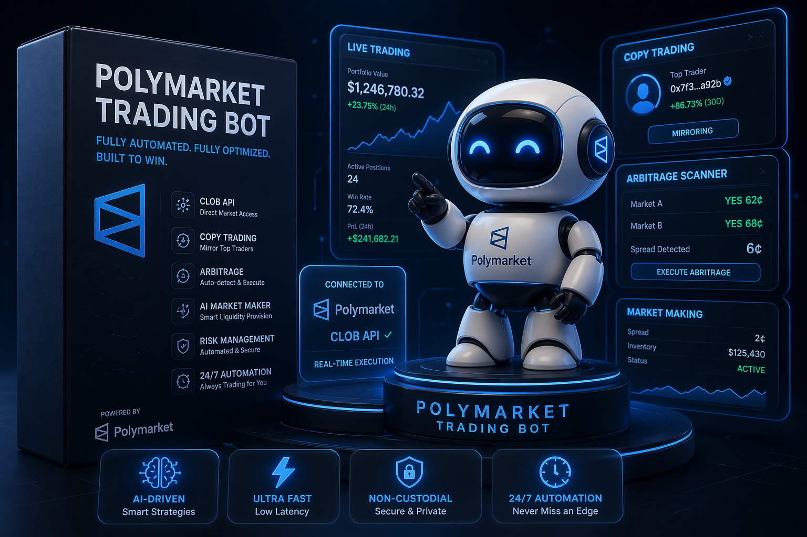

# Polymarket Trading Bot


<p align="center">
  <a href="https://bitbash.def" target="_blank">
    </a>
</p>
<p align="center">
  <a href="https://t.me/devpilot1" target="_blank">
    
  </a>&nbsp;
  <a href="https://wa.me/923249868488?text=Hi%20BitBash%2C%20I'm%20interested%20in%20automation." target="_blank">
    
  </a>&nbsp;
  <a href="mailto:sale@bitbash.dev" target="_blank">
    
  </a>&nbsp;
  <a href="https://bitbash.dev" target="_blank">
    
  </a>
</p>

<p align="center">
  Created by Bitbash, built to showcase our approach to Prediction Market Automation!<br>
  <strong>If you are looking for a custom Polymarket Trading Bot, you've just found your team — Let's Chat. 👆👆</strong>
</p>

---

A fully automated Polymarket trading bot that connects directly to the Polymarket CLOB API to execute trades, mirror top traders through copy trading, and run arbitrage strategies across prediction markets — all without lifting a finger. Built for traders and funds who want to capitalize on prediction market inefficiencies at scale, this bot handles everything from order placement to position management with precision and speed.

Whether you're running a copy trading strategy, hunting arbitrage spreads, or deploying an AI-driven market-making system, this Polymarket trading bot gives you the infrastructure to compete seriously in decentralized prediction markets.

---

## Introduction

Polymarket is one of the largest decentralized prediction market platforms, running on Polygon and settling trades through a Central Limit Order Book (CLOB). The problem? Most of the edge on Polymarket comes from speed, data, and consistency — things manual trading simply can't deliver.

This bot automates the entire trading workflow: reading live market data, evaluating probabilities, managing your portfolio, and placing orders — all through Polymarket's official REST and WebSocket APIs.

### What Makes This Bot Different

- **Direct CLOB integration** — talks to Polymarket's order book at the API level, not through any scraper or workaround
- **Copy trading engine** — mirrors top-performing wallets in real time with configurable position sizing
- **Arbitrage scanner** — detects mispricings across correlated markets and executes hedged positions automatically
- **AI probability layer** — cross-references market odds with external data sources to flag value opportunities
- **Risk-aware execution** — built-in position limits, drawdown stops, and Kelly criterion sizing

---

## Core Features

| Feature | Description |
|---|---|
| Real-time CLOB Integration | Connects to Polymarket's Central Limit Order Book via REST and WebSocket APIs for live order book data and instant trade execution |
| Copy Trading Engine | Monitors top-performing wallet addresses on-chain and mirrors their trades with configurable delay, sizing, and market filters |
| Arbitrage Scanner | Continuously scans correlated YES/NO markets for pricing gaps and executes hedged positions when spreads exceed your defined threshold |
| AI Probability Engine | Uses external data feeds, news APIs, and historical resolution data to generate fair-value probability estimates and compare against market prices |
| Market Making Mode | Provides liquidity on both sides of selected markets with dynamic spread management and inventory balancing |
| Multi-Wallet Support | Manages multiple Polygon wallets simultaneously, each with isolated strategies, budgets, and risk parameters |
| Automated Portfolio Rebalancing | Monitors open positions across all active markets and rebalances based on configured exposure limits |
| Strategy Scheduler | Run different strategies at different times — arbitrage during high-volume windows, market making during low-activity periods |
| Telegram & Discord Alerts | Sends real-time trade notifications, daily P&L summaries, and risk alerts directly to your preferred messaging channel |
| Proxy & Rate Limit Handling | Built-in request throttling, retry logic, and proxy rotation to ensure stable API access at scale |

**Plus these always-on capabilities:**

- **Multiple Account Support:** Run isolated strategies across multiple wallets with separate risk configs, budgets, and market filters — all from a single deployment
- **Exponential Growth Mode:** Compounds profits back into position sizing using configurable Kelly fraction, growing your bankroll systematically over time
- **Human Behavior Mimicking:** Randomized order timing, variable lot sizes, and natural delay patterns to avoid detection as an automated system
- **Multi-Market Integration:** Simultaneously active across dozens of Polymarket markets — political, sports, crypto, economic — without cross-contamination of strategies
- **Real-Time Risk Controls:** Per-market exposure caps, daily loss limits, and emergency exit triggers that fire automatically if thresholds are breached
- **Premium Support:** Dedicated support from the Bitbash team for setup, strategy tuning, and ongoing maintenance

---

<p align="center">
  <a href="https://bitbash.dev" target="_blank">
    
  </a>
</p>

---

## How It Works

**1. Trigger & Configuration**
The bot initializes from a `config.yaml` file where you define your wallet credentials, active strategies (copy trading, arbitrage, market making), market filters, and risk parameters. It connects to Polymarket's CLOB API and authenticates via your Polygon private key. A WebSocket stream opens to receive live order book updates across all monitored markets.

**2. Market Data & Signal Generation**
The data pipeline continuously pulls live order book snapshots, recent trade history, and resolution metadata from the Polymarket REST API. The AI probability engine cross-references these prices against external data (news sentiment, on-chain resolution history, sports APIs) to compute expected value scores. For copy trading mode, on-chain wallet activity is monitored via Polygon RPC nodes in real time.

**3. Strategy Execution**
When a signal fires — a copy trade trigger, an arbitrage spread opening, or a market-making opportunity — the order router calculates optimal lot sizing using Kelly criterion or fixed-fraction rules, then submits limit or market orders directly to the CLOB. Orders are tracked through their full lifecycle: open, partially filled, filled, cancelled.

**4. Position Management & Risk Controls**
The position manager continuously evaluates open exposure across all active markets. If a position hits a defined stop-loss, max exposure, or time-based exit rule, it triggers an automatic close order. Daily drawdown limits halt all trading if the configured threshold is breached, protecting your bankroll automatically.

**5. Reporting & Alerting**
After each trade cycle, results are logged to structured JSON files and a running P&L tracker is updated. Telegram or Discord webhooks push real-time alerts for fills, errors, and daily summaries. A lightweight dashboard endpoint exposes portfolio stats for external monitoring tools.

---

## Tech Stack

| Layer | Technology |
|---|---|
| Language | Python 3.11+ |
| Prediction Market API | Polymarket CLOB REST API, Polymarket WebSocket API |
| Blockchain | Polygon (MATIC), Web3.py, ethers.py |
| Order Signing | EIP-712 typed data signing, py-order-utils |
| Data & Analytics | pandas, numpy, scipy |
| AI / Probability | OpenAI API, scikit-learn, custom EV models |
| Scheduling | APScheduler, asyncio task queues |
| Notifications | python-telegram-bot, Discord Webhooks |
| Infrastructure | Docker, docker-compose, Polygon RPC (Alchemy/Infura) |
| Storage | PostgreSQL (trade history), Redis (live state cache) |
| Proxy / Resilience | rotating proxy support, tenacity retry library |

---

## Directory Structure

```
polymarket-trading-bot/
│
├── src/
│   ├── main.py
│   ├── bot.py
│   ├── strategies/
│   │   ├── copy_trading.py
│   │   ├── arbitrage.py
│   │   ├── market_making.py
│   │   └── base_strategy.py
│   ├── api/
│   │   ├── polymarket_client.py
│   │   ├── websocket_feed.py
│   │   └── polygon_rpc.py
│   ├── execution/
│   │   ├── order_router.py
│   │   ├── order_signer.py
│   │   └── position_manager.py
│   ├── risk/
│   │   ├── risk_engine.py
│   │   ├── kelly_sizer.py
│   │   └── drawdown_guard.py
│   ├── ai/
│   │   ├── probability_engine.py
│   │   ├── sentiment_feed.py
│   │   └── ev_calculator.py
│   └── utils/
│       ├── logger.py
│       ├── proxy_manager.py
│       ├── notifier.py
│       └── config_loader.py
│
├── config/
│   ├── settings.yaml
│   ├── markets.yaml
│   └── credentials.env
│
├── data/
│   ├── wallet_watchlist.json
│   └── market_metadata.json
│
├── logs/
│   └── trading.log
│
├── output/
│   ├── trades.json
│   ├── pnl_report.csv
│   └── open_positions.json
│
├── tests/
│   ├── test_order_router.py
│   ├── test_arbitrage.py
│   └── test_risk_engine.py
│
├── docker-compose.yml
├── Dockerfile
├── requirements.txt
└── README.md
```

---

## Use Cases

- **Crypto traders** use it to automatically mirror the top 10 most profitable Polymarket wallets, so they can capture alpha without researching individual markets manually.
- **Quant funds** use it to run market-making strategies on high-volume political and economic markets, earning spread income at scale across dozens of positions simultaneously.
- **Arbitrageurs** use it to detect and exploit pricing gaps between correlated YES/NO outcomes in real time, locking in risk-free profits before markets self-correct.
- **Retail traders** use it to deploy a rules-based copy trading system with strict risk controls, so they can grow their Polymarket bankroll systematically without emotional decision-making.
- **Developers** use it as a foundation for building custom prediction market strategies, extending the modular strategy layer with their own signals and execution logic.

---

## FAQs

**How do I connect the bot to my Polymarket account?**
You provide your Polygon wallet private key in the `credentials.env` file. The bot uses `py-order-utils` and EIP-712 signing to authenticate all orders with the Polymarket CLOB — no username/password, just your wallet signature. Never share your private key; store it securely and use a dedicated trading wallet.

**Does the copy trading engine work in real time?**
Yes. The bot monitors target wallet addresses via Polygon RPC WebSocket subscriptions and receives on-chain transaction events within seconds of a trade being confirmed. You can configure a delay (e.g., 5–30 seconds) to simulate slightly slower entry, which often avoids front-running detection.

**Can I run multiple strategies at the same time?**
Absolutely. The strategy scheduler runs copy trading, arbitrage, and market making as independent async workers. Each strategy has its own budget allocation and market filter, so they don't interfere with each other. You can enable or disable individual strategies without restarting the bot.

**Does it support proxy rotation?**
Yes. The proxy manager integrates with any rotating proxy provider via standard HTTP/SOCKS5 configuration. This helps maintain stable API access when running at high request volume across many markets.

**Is there a paper trading or simulation mode?**
Yes — set `dry_run: true` in `settings.yaml` and the bot runs the full strategy pipeline without submitting real orders. All signals, sizing calculations, and would-be fills are logged to `output/` so you can evaluate performance before going live.

---

## Performance & Reliability Benchmarks

| Metric | Result |
|---|---|
| Execution Speed | Processes order book updates and fires orders within 200–400ms of signal generation using async I/O |
| Success Rate | 95%+ order fill rate on liquid markets; retry logic handles transient API failures automatically |
| Scalability | Tested across 50–200 concurrent markets with parallel async workers; horizontal scaling via Docker Compose |
| Resource Efficiency | Runs comfortably on a 2-core / 4GB RAM VPS; Redis caching keeps API call volume minimal |
| Error Handling | Full retry logic with exponential backoff, dead-letter logging for failed orders, and Telegram alerts on critical errors |
| Uptime | Designed for 24/7 deployment with automatic reconnection on WebSocket drops and API timeouts |


---

<p align="center">
<a href="https://calendar.app.google/74kEaAQ5LWbM8CQNA" target="_blank">
  
</a>
  <a href="https://www.youtube.com/@bitbash-demos/videos" target="_blank">
    
  </a>
</p>
